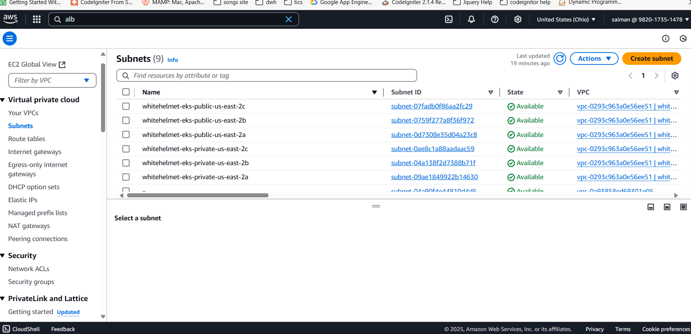
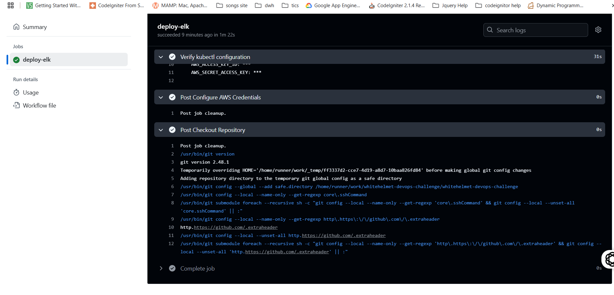

# **Terraform Infrastructure Deployment - WhiteHelmet IAC CI**

## **Overview**
This repository contains the **Infrastructure as Code (IAC) setup** for deploying an **AWS EKS cluster** using **Terraform**. The deployment process is automated using **GitHub Actions**, and the workflow file **`terraform.yaml`** handles the provisioning of AWS resources.


## **GitHub Actions Workflow Screenshots**  
Below are the screenshots of the GitHub Actions execution for the **Terraform IAC deployment**:

### **Terraform Execution Steps**  

#### **1️⃣ Terraform Initialization & Plan Execution**
  
*Terraform is initialized and prepares the execution plan.*

#### **2️⃣ Terraform Plan Validation**
  
*Validation of the Terraform Plan before applying changes.*

#### **3️⃣ Terraform Apply Execution**
  
*Terraform apply is executed to provision AWS resources.*

#### **4️⃣ AWS EKS Cluster & Kubernetes Configurations**
  
*EKS Cluster is deployed, and the Kubernetes configurations are updated.*


## **Real-World Implementation vs. Assignment Implementation**

| **Aspect**            | **Real-World Best Practice**  | **Assignment Implementation** |
|-----------------------|-----------------------------|--------------------------------|
| **Repository Structure** | Separate `iac-repo` for infrastructure and `app-repo` for applications. | Single repository with infrastructure and application. |
| **Triggering Mechanism** | Auto-trigger `terraform plan` on `stage` branch and `terraform apply` on merge to `main`. | Manual trigger (`workflow_dispatch`). |
| **State Management** | Remote backend with **S3 & DynamoDB** for state locking. | S3 backend but no state locking in DynamoDB. |
| **Approval Process** | Terraform Plan requires a manual approval before `apply`. | Terraform Apply runs immediately after `plan` in manual execution. |

## **Terraform Workflow Steps**

### **1️⃣ Checkout the Source Code**
```yaml
- name: Checkout Source Code
  uses: actions/checkout@v4
```
Retrieves the latest Terraform code from the repository.

### **2️⃣ Setup Terraform**
```yaml
- name: Setup Terraform
  uses: hashicorp/setup-terraform@v2
```
Installs Terraform on the runner.

### **3️⃣ Initialize Terraform**
```yaml
- name: Terraform Init
  id: init
  run: terraform init -backend-config="bucket=$BUCKET_TF_STATE"
```
Initializes Terraform and connects to an **S3 backend** to store the Terraform state.

### **4️⃣ Validate Terraform Code**
```yaml
- name: Terraform Format
  id: fmt
  run: terraform fmt -check

- name: Terraform Validate
  id: validate
  run: terraform validate
```
Ensures that the **Terraform syntax is correctly formatted** and valid.

### **5️⃣ Generate Execution Plan**
```yaml
- name: Terraform Plan
  id: plan
  run: terraform plan -no-color -input=false -out planfile
  continue-on-error: true
```
Creates a **Terraform execution plan**, which previews the changes before applying them.

### **6️⃣ Conditional Approval in Real-World (Manual Dispatch in Assignment)**
| **Real-World Scenario** | **Assignment Implementation** |
|-------------------------|--------------------------------|
| Terraform `plan` is reviewed and manually approved before merging `stage → main`. | Since this is manual dispatch, `terraform apply` is triggered directly after `plan`. |

```yaml
- name: Terraform Plan Status
  if: steps.plan.outcome == 'failure'
  run: exit 1
```
Stops execution if **`terraform plan` fails**.

### **7️⃣ Apply Terraform Configuration**
```yaml
- name: Terraform Apply
  id: apply
  if: github.event_name == 'workflow_dispatch'
  run: terraform apply -auto-approve -input=false -parallelism=1 planfile
```
Applies Terraform changes and provisions the AWS infrastructure.

### **8️⃣ Configure AWS Credentials**
```yaml
- name: Configure AWS credentials
  uses: aws-actions/configure-aws-credentials@v1
  with:
    aws-access-key-id: ${{ secrets.AWS_ACCESS_KEY_ID }}
    aws-secret-access-key: ${{ secrets.AWS_SECRET_ACCESS_KEY }}
    aws-region: ${{ env.AWS_REGION }}
```
Grants **GitHub Actions** access to AWS.

### **9️⃣ Fetch Kubernetes Config for EKS**
```yaml
- name: Get Kube config file
  id: getconfig
  if: steps.apply.outcome == 'success'
  run: aws eks update-kubeconfig --region ${{ env.AWS_REGION }} --name ${{ env.EKS_CLUSTER }}
```
Updates the **kubectl configuration** to interact with the newly created EKS cluster.

### **🔟 Deploy AWS Load Balancer Controller**
```yaml
- name: Install Ingress Controller
  if: steps.apply.outcome == 'success' && steps.getconfig.outcome == 'success'
  run: kubectl apply -f https://raw.githubusercontent.com/kubernetes/ingress-nginx/controller-v1.1.3/deploy/static/provider/aws/deploy.yaml
```
Deploys an **Nginx ingress controller** which creates an **Application Load Balancer (ALB)** in AWS.

## **Expected Outcome**
When this workflow is executed:
1. **Terraform provisions AWS networking components** (VPC, subnets, NAT Gateway).
2. **An EKS cluster is created** along with required IAM roles.
3. **ALB Ingress Controller is deployed**, making it possible to route external traffic.


## **Infrastructure Deployment Verification**  
After the successful execution of the **Terraform IAC workflow**, the following AWS resources were provisioned.

### **1️⃣ Virtual Private Cloud (VPC)**
  
*A dedicated VPC was created to isolate the Kubernetes cluster.*

### **2️⃣ Subnet Configuration**
  
*Subnets were configured to allow communication between cluster components.*

### **3️⃣ NAT Gateway for Internet Access**
  
*NAT Gateway was provisioned to allow outbound traffic from private subnets.*

### **4️⃣ AWS EKS Cluster Creation**
  
*EKS cluster was successfully created and registered.*

### **5️⃣ Kubernetes Ingress Controller (ALB)**
  
*An AWS Application Load Balancer (ALB) was created for external communication.*

### **6️⃣ Kubernetes Ingress Resource**
  
*Ingress rules were set up to route external traffic to services inside the cluster.*


With the **Terraform IAC workflow**, the entire infrastructure—including **VPC, EKS, ALB Ingress, and the ELK stack**—was successfully deployed on AWS. This setup allows for a scalable and automated cloud environment, integrating **GitOps principles for seamless infrastructure management.** 🚀

## **Next Steps: Deploying Applications**
After this Terraform workflow completes, the **ELK Stack Deployment** workflow (`elk.yaml`) can be triggered to:
- Deploy **Elasticsearch, Kibana, and Logstash** into the EKS cluster.
- Configure **Helm charts** for monitoring and logging.

## **Conclusion**
This `terraform.yaml` workflow enables **repeatable, automated AWS infrastructure deployment**. In a real-world setup:
- This workflow would reside in a **separate IAC repository**.
- **Terraform apply would be restricted** until an engineer manually approves the `terraform plan` changes.
- The **AWS backend should use DynamoDB** for **state locking**.

🚀 **This implementation ensures a scalable, automated AWS infrastructure setup using Terraform & GitHub Actions!** 🚀


# **ELK Stack Deployment - GitHub Actions Workflow**

## **Overview**
This workflow **`elk.yaml`** is responsible for deploying the **ELK Stack (Elasticsearch, Logstash, Kibana)** on an **AWS EKS cluster**. It automates the process using **Helm**, a package manager for Kubernetes.

### **Real-World Implementation vs. Assignment Implementation**
| **Aspect**            | **Real-World Best Practice**  | **Assignment Implementation** |
|-----------------------|-----------------------------|--------------------------------|
| **Repository Structure** | Separate `app-repo` for deployment. | Single repository for both infrastructure and deployment. |
| **Triggering Mechanism** | Deployment triggered by a **CI/CD pipeline** upon merging to `main`. | Manual trigger (`workflow_dispatch`). |
| **Helm Chart Management** | Managed via **Helm repository** (e.g., `chartmuseum`). | Local Helm charts (`helm/whitehelmetcharts`). |
| **Namespace Management** | Managed separately for each environment (dev, staging, prod). | Single `elk` namespace used. |

---
### **GitHub Actions Workflow Execution**

The deployment of the ELK stack on **AWS EKS** is executed through **GitHub Actions**. Below are the captured screenshots of the **CI/CD pipeline in action**:

### **1️⃣ GitHub Actions - Workflow Start**
  
*GitHub Actions workflow is triggered manually (`workflow_dispatch`) to deploy ELK to EKS.*

### **2️⃣ GitHub Actions - Deployment Progress**
  
*The pipeline executes `terraform apply`, provisions the EKS cluster, and starts deploying ELK components.*

### **3️⃣ GitHub Actions - Successful Deployment**
  
*ELK deployment completes successfully, and Kubernetes services become accessible.*

These images provide a clear **visual representation** of the **GitHub Actions automation process** used to deploy ELK on AWS EKS. 🚀

## **Workflow Breakdown**

### **1️⃣ Checkout Repository**
```yaml
- name: Checkout Repository
  uses: actions/checkout@v4
```
Retrieves the latest deployment code.

### **2️⃣ Configure AWS Credentials**
```yaml
- name: Configure AWS Credentials
  uses: aws-actions/configure-aws-credentials@v1
  with:
    aws-access-key-id: ${{ secrets.AWS_ACCESS_KEY_ID }}
    aws-secret-access-key: ${{ secrets.AWS_SECRET_ACCESS_KEY }}
    aws-region: ${{ env.AWS_REGION }}
```
Configures AWS credentials to interact with **EKS and Helm**.

### **3️⃣ Verify AWS Identity**
```yaml
- name: Verify AWS Credentials
  run: aws sts get-caller-identity
```
Ensures AWS credentials are valid.

### **4️⃣ Install `kubectl` for Kubernetes**
```yaml
- name: Install kubectl
  run: |
    sudo apt-get update
    sudo apt-get install -y kubectl
```
Installs **kubectl**, which is required for Kubernetes management.

### **5️⃣ Update kubeconfig for AWS EKS**
```yaml
- name: Configure kubectl for AWS EKS
  run: aws eks update-kubeconfig --region ${{ env.AWS_REGION }} --name ${{ env.EKS_CLUSTER }}
```
Updates the **Kubeconfig file** to allow interaction with the EKS cluster.

### **6️⃣ Wait for Resources**
```yaml
- name: Wait for Resources
  run: sleep 30
```
Waits for the cluster to stabilize before deploying the ELK stack.

### **7️⃣ Deploy ELK Stack using Helm**
```yaml
- name: Deploy ELK Stack using Helm
  run: |
    kubectl config view
    helm upgrade --install elk-stack helm/whitehelmetcharts --namespace ${{ env.NAMESPACE }} --create-namespace
```
- **Helm** is used to deploy the ELK stack (`helm upgrade --install`).
- The deployment uses **Helm charts stored in `helm/whitehelmetcharts`**.
- If the namespace `elk` does not exist, it is created.

### **8️⃣ Verify Kubernetes Services**
```yaml
- name: Verify kubectl configuration
  run: | 
    sleep 30
    kubectl get svc -n ${{ env.NAMESPACE }}
```
- Waits for **pods** and services to be ready.
- Retrieves the **services running in the ELK namespace**.

---

## **Expected Outcome**
When this workflow is executed:
1. **Helm deploys the ELK stack** into **EKS**.
2. **Elasticsearch, Kibana, and Logstash pods start running**.
3. **AWS Load Balancer is provisioned**, allowing external access.

---

## **Deployment Verification Screenshots**
### **1️⃣ ELK Services Running**
  
*All ELK services (Elasticsearch, Logstash, Kibana) are deployed and running inside Kubernetes.*

### **2️⃣ Kubernetes Pods**
  
*Displays all pods running in the `elk` namespace.*

### **3️⃣ Elasticsearch Pod Details**
  
*Elasticsearch is running inside the cluster.*

### **5️⃣ Kibana UI (Port 5601)**
  
*Kibana is accessible on port 5601 through the AWS Load Balancer.*

---

## **Conclusion**
The **ELK deployment workflow (`elk.yaml`)** ensures a **scalable, repeatable, and automated deployment** of the **ELK Stack** on **AWS EKS**. This is a crucial step in **log aggregation and monitoring** in cloud environments. 🚀
